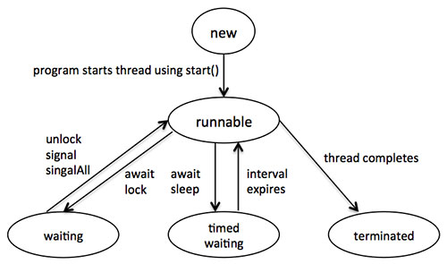

# Java 多线程

Java 是一种多线程编程语言，这意味着我们能用 java 开发多线程程序。一个多线程程序包含两个或更多的能并行运行的部分，并且每一部分能最优利用可用资源，尤其是当你的计算机有多个 CPU 时，同时解决不同的任务。  

多任务处理表示多个过程共同处理像CPU这样共享的资源时。多线程将多任务处理的思想扩展到应用程序，你可以将一个单独的应用中的特定的操作细分为单独的线程。每一个线程能并行地运行。操作系统不仅在不同的应用程序中划分处理时间，而且在一个应用程序中的每一个线程中也是如此。

多线程让你可以用一种多个活动能并行地在同一个程序中进行的方法编写程序。  

## 线程的生命周期

一个线程在它的生命周期中通过不同的阶段。例如，一个线程生成，开始，运行，然后死亡。下列的图表展示了一个线程的完整的生命周期。

  

上述提到的阶段在这解释：  

- **new:** 一个新的线程以一个新的状态开始了它的生命周期。它始终留在这个状态中直到程序开始线程。它也被称为一个生成的进程。
- **Runnable:** 在一个新生成的线程开始后，这个线程变得可运行。在这个状态下的线程被认为正在执行任务。  
- **Waiting:** 有时候，一个线程当它等待另一个线程工作时跃迁到等待状态。一个线程仅当另一个线程发信号给等待的线程继续执行才跃迁回可运行转态。
- **Timed waiting:** 一个可运行的线程能进入定时等待状态等待指定的时间间隔。在这种转态下的线程当时间间隔死亡或者当它所等待的活动发生时跃迁回可运行状态。  
- **Terminated:** 一个可运行的线程，当它完成了它的任务后进入 terminated 状态，否则它就结束。  

## 线程优先级

每一个 Java 线程有一个帮助操作系统决定线程调度顺序的优先级。  

Java 线程的优先级在 MIN_PRIORITY（一个为1的常数）和 MAX_PRIORITY（一个为10的常数)的范围内。缺省状况下，每一个线程给予优先级  NORM_PRIORITY（一个为5的常数）。  

拥有更高优先级的线程对于一个程序来说更加重要，应当在低优先级的线程前被分配处理时间。然而，线程优先级不能保证线程执行和所依赖的平台。

## 通过实现 Runnable 接口创建线程

如果你的类想要作为一个线程被执行，那么你可以通过实现 Runnable 接口来到达这个目的。你将需要遵从三个基本步骤：  

步骤一：
  
作为第一步你需要实现由 Runnable 接口提供的 run() 方法。这个方法为线程提供了进入点并且你将把你完全的业务逻辑放入方法中。下列是简单的 run() 方法语法：
  
```
public void run( )
```

步骤二：
  
在第二步你将使用以下的构造函数实例化一个 Thread 对象:
  
```
Thread(Runnable threadObj, String threadName);
```

threadObj 是实现 Runnable 接口的类的一个实例，threadName 是给新线程的名字。  

步骤三：

一旦 Thread 对象被创建，你可以通过调用 run() 方法的 start() 方法来开始它。以下是 start() 方法的简单语法：  

```
void start( );
```

### 示例

这里是一个创建一个新线程并使之运行的例子：  

```
class RunnableDemo implements Runnable {
   private Thread t;
   private String threadName;
   
   RunnableDemo( String name){
       threadName = name;
       System.out.println("Creating " +  threadName );
   }
   public void run() {
      System.out.println("Running " +  threadName );
      try {
         for(int i = 4; i > 0; i--) {
            System.out.println("Thread: " + threadName + ", " + i);
            // Let the thread sleep for a while.
            Thread.sleep(50);
         }
     } catch (InterruptedException e) {
         System.out.println("Thread " +  threadName + " interrupted.");
     }
     System.out.println("Thread " +  threadName + " exiting.");
   }
   
   public void start ()
   {
      System.out.println("Starting " +  threadName );
      if (t == null)
      {
         t = new Thread (this, threadName);
         t.start ();
      }
   }

}

public class TestThread {
   public static void main(String args[]) {
   
      RunnableDemo R1 = new RunnableDemo( "Thread-1");
      R1.start();
      
      RunnableDemo R2 = new RunnableDemo( "Thread-2");
      R2.start();
   }   
}
```

这将产生以下结果：  

```
Creating Thread-1
Starting Thread-1
Creating Thread-2
Starting Thread-2
Running Thread-1
Thread: Thread-1, 4
Running Thread-2
Thread: Thread-2, 4
Thread: Thread-1, 3
Thread: Thread-2, 3
Thread: Thread-1, 2
Thread: Thread-2, 2
Thread: Thread-1, 1
Thread: Thread-2, 1
Thread Thread-1 exiting.
Thread Thread-2 exiting.
```

## 通过继承 Thread 类来创建线程

第二个创建线程的方法是创建一个通过使用以下两个简单步骤继承 Thread 类的新的类。这个方法在解决 Thread 类中使用可行方法创建的多线程的问题上提供了更多的灵活性。  

步骤一：

你将需要覆写 Thread 类中可用的 run()方法。这个方法为线程提供入口并且你将把你完全的业务逻辑放入方法中。以下是 run()方法的简单的语法。
  
```
public void run( )
```

步骤二：
  
一旦 Thread 对象被创建，你可以通过调用 run()方法的 start() 方法来开始它。以下是 start() 方法的简单语法：  

```
void start( );
```

### 示例

这是前面的重写继承 Thread 的程序：
  
```
class ThreadDemo extends Thread {
   private Thread t;
   private String threadName;
   
   ThreadDemo( String name){
       threadName = name;
       System.out.println("Creating " +  threadName );
   }
   public void run() {
      System.out.println("Running " +  threadName );
      try {
         for(int i = 4; i > 0; i--) {
            System.out.println("Thread: " + threadName + ", " + i);
            // Let the thread sleep for a while.
            Thread.sleep(50);
         }
     } catch (InterruptedException e) {
         System.out.println("Thread " +  threadName + " interrupted.");
     }
     System.out.println("Thread " +  threadName + " exiting.");
   }
   
   public void start ()
   {
      System.out.println("Starting " +  threadName );
      if (t == null)
      {
         t = new Thread (this, threadName);
         t.start ();
      }
   }

}

public class TestThread {
   public static void main(String args[]) {
   
      ThreadDemo T1 = new ThreadDemo( "Thread-1");
      T1.start();
      
      ThreadDemo T2 = new ThreadDemo( "Thread-2");
      T2.start();
   }   
}
```

这将会产生以下结果：  

```
Creating Thread-1
Starting Thread-1
Creating Thread-2
Starting Thread-2
Running Thread-1
Thread: Thread-1, 4
Running Thread-2
Thread: Thread-2, 4
Thread: Thread-1, 3
Thread: Thread-2, 3
Thread: Thread-1, 2
Thread: Thread-2, 2
Thread: Thread-1, 1
Thread: Thread-2, 1
Thread Thread-1 exiting.
Thread Thread-2 exiting.
```

## Thread 方法

以下是在 Thread 类中可以获得的重要方法的列表。  

|SN      |接口描述   |
|:----------|:----|
|1 |**Methods with Description**<br>在一个独立的执行路径中开始一个线程，然后在这个 Thread 对象上调用 run() 方法。|
|2 |**public void run()**<br>如果这个 Thread 对象是使用一个单独的 Runnable 目标实例化的,run()方法被 Runnable 对象调用。|
|3 |**public final void setName(String name)**<br>改变 Thread 对象的名字。也有一个 getName()方法来检索名字。|
|4 |**public final void setPriority(int priority)**<br>设置 Thread 对象的优先级。可能的值在 1 到 10 之间。|
|5 |**public final void setDaemon(boolean on)**<br>一个真值将这个线程标志为守护进程。|
|6 |**public final void join(long millisec)**<br>当前进程在第二个线程上调用这个方法，使得当前进程阻塞直到第二个线程终结或者指定的毫秒数过去。|
|7 |**public void interrupt()**<br>中断这个进程，如果由于任何原因而阻塞，使得它也继续执行。|
|8 | **public final boolean isAlive()**<br>如果线程是活的，返回真值，可在线程已经开始但在运行到完成之前的任何时间。|

以前的方法是被一个特殊的 Thread 对象调用的。以下在 Thread 类中的方法是静态的。调用静态方法会在当前运行的线程上执行操作。

|SN      |接口描述   |
|:----------|:-----|
|1 |**public static void yield()**<br>使得当前正在运行的线程让步于任何其他相同优先级的正在等待调度的线程。|
|2 |**public static void sleep(long millisec)**<br>使当前运行的线程阻塞至少指定的毫秒数。|
|3 |**public static boolean holdsLock(Object x)**<br>如果当前线程持有给定对象的锁，返回真值。|
|4 |**public static Thread currentThread()**<br>返回对当前运行的线程的引用，也就是调用这个方法的线程。|
|5 |**public static void dumpStack()**<br>为当前运行的线程打印堆栈跟踪，这在当调试多线程应用程序时是有用的。|
 

### 示例

以下 ThreadClassDemo 程序展示了一些 Thread 类的方法。考虑实现 Runnable 的类 DisplayMessage:  

```
// File Name : DisplayMessage.java
// Create a thread to implement Runnable
public class DisplayMessage implements Runnable
{
   private String message;
   public DisplayMessage(String message)
   {
      this.message = message;
   }
   public void run()
   {
      while(true)
      {
         System.out.println(message);
      }
   }
}
```

以下是继承 Thread 类的另一个类：  

```
// File Name : GuessANumber.java
// Create a thread to extentd Thread
public class GuessANumber extends Thread
{
   private int number;
   public GuessANumber(int number)
   {
      this.number = number;
   }
   public void run()
   {
      int counter = 0;
      int guess = 0;
      do
      {
          guess = (int) (Math.random() * 100 + 1);
          System.out.println(this.getName()
                       + " guesses " + guess);
          counter++;
      }while(guess != number);
      System.out.println("** Correct! " + this.getName()
                       + " in " + counter + " guesses.**");
   }
}
```

以下是使用上面定义的类的主程序:  

```
// File Name : ThreadClassDemo.java
public class ThreadClassDemo
{
   public static void main(String [] args)
   {
      Runnable hello = new DisplayMessage("Hello");
      Thread thread1 = new Thread(hello);
      thread1.setDaemon(true);
      thread1.setName("hello");
      System.out.println("Starting hello thread...");
      thread1.start();
      
      Runnable bye = new DisplayMessage("Goodbye");
      Thread thread2 = new Thread(bye);
      thread2.setPriority(Thread.MIN_PRIORITY);
      thread2.setDaemon(true);
      System.out.println("Starting goodbye thread...");
      thread2.start();

      System.out.println("Starting thread3...");
      Thread thread3 = new GuessANumber(27);
      thread3.start();
      try
      {
         thread3.join();
      }catch(InterruptedException e)
      {
         System.out.println("Thread interrupted.");
      }
      System.out.println("Starting thread4...");
      Thread thread4 = new GuessANumber(75);
      
	  thread4.start();
      System.out.println("main() is ending...");
   }
}
```

这将产生以下结果。你可以一次一次地尝试这个例子并且你将每次得到不同的结果。

```
Starting hello thread...
Starting goodbye thread...
Hello
Hello
Hello
Hello
Hello
Hello
Goodbye
Goodbye
Goodbye
Goodbye
Goodbye
.......
```

## 主要的 Java 多线程概念

当用 Java 进行多线程编程时，你将需要有以下的概念：  

- [什么是线程同步？](http://www.tutorialspoint.com/java/java_thread_synchronization.htm)  

- [处理线程间通信](http://www.tutorialspoint.com/java/java_thread_communication.htm)  

- [处理线程死锁](http://www.tutorialspoint.com/java/java_thread_deadlock.htm)  

- [主要的线程操作](http://www.tutorialspoint.com/java/java_thread_control.htm)  
